# Tiny Market - NFT Marketplace

Tiny Market project is an NFT marketplace operating as a social media platform that uses blockchain and smart contract technology to safely and reliable exchange NFTs for STX. The marketplace is developed using clarity.

The current trading on the marketplace runs off the stacks Testnet. It does still display users personal Mainnet assets, however, they are not able to be traded or listed.

## Minting Process
- Users need to be aware that transactions on this site will use funds from there stacks Testnet wallet.
- Users need to be aware that network fees associated with transactions can not be refunded.
- Cost for minting an NFT is free however standard users are currently unable to mint there own NFTs.

## Clarity Camp Oriented Development
This projects development approach was inspired by the work of Stacks Foundation. 

Learning and development was assisted by the Clarity Camp course which they established to teach the clarity language and how to develop deployable smart contracts.

For more information on the course developed by Stacks Foundation vist here:
```bash
https://learn.stacks.org/
```
## Smart-Contracts
Use the folder 'tiny-market' to find contents for BACKEND code. Within the 'contracts' directory the marketplaces smart contracts and code can be found.

Alternatively deployed versions of the contracts can be found using the below links:

sip009-nft Contract:

* https://explorer.hiro.so/txid/ST1NWPSRC02Z9A20RHSBGDEDG9H8CHS6ENJ2N3TTH.sip009-nft?chain=testnet

tiny-market Contract:

* https://explorer.hiro.so/txid/ST1NWPSRC02Z9A20RHSBGDEDG9H8CHS6ENJ2N3TTH.tiny-market?chain=testnet


### sip009-nft Contract
Purpose: This contract mimcs a stacks SIP009 contract and is used to mint another NFTs for __ STX

Important Functions:
* mint - public function which allows for the an NFT to be minted.
* get-owner - read_only function which retrives the wallet id of the asset owner.
* get-token-uri - read_only function which is used to retrieve the metadata for the asset.

### tiny-market Contract
Purpose: This contract is used to fulfilling listings, purchases and cancelling listings.

Important Functions:
* fulfil-listing-stx - public function which is used to fulfil a purchasing of an NFT using STX.
* list-asset - public function which fulfil a sell listing of an NFT.
* cancel-listing - public function which is used to cancel a sell listing made (can only be called by user who listed NFT).

## User Interface
Code related to the FRONTEND can be found in frontend-tinymarket.
Javascript with StacksJS is used in FRONTEND development for the following reasons:
- More direct control over interactions with Testnet because of low-level API.
- More developer friendly as had more access to documentation.
- Not pre-configured provided developers with more control over FRONTEND and BACKEND.

## NFT Image Displaying
### Testnet NFTs
The wallets Testnet asset details are able to be displayed, however, at this stage the image is hardcoded into the project. If phase 2 was to go forward a new nft contract that had a hash value for the minted Testnet images inside the contract that we could call.

### Mainnet NFTs
* To display images for mainnet assets, we call the get-token-uri function inside the NFTs contract.
* This then returns an object that we extract the ipfs value from result.value.value.data
* We then use a function we created called convertIpfsUrl with replaces the 'ipfs://ipfs/' with 'https://ipfs.io/ipfs/'.
```bash
e.g https://ipfs.io/ipfs/QmNP4KCcwzKpnLk9hSTFQHz3RicagwHFAFxD4srUeTsjgQ/
```
* We then use a function called fetchDataFromIpfs and retrieve data.image. From this data.image we use the convertIpfsUrl function again to retrieve the image url and use that as the img source.
```bash
e.g https://ipfs.io/ipfs/QmbcHTZ6ZKGZWBAPS2hgaNSbKNMwyi7QvRzsm5Cejv8b78
```

# Getting Started as a User
Follow these instructions to set up the project on your local machine for marketplace use, along with development and testing if desired.

## Prerequisites
Ensure you have Visual Studio Code, Node.js installed on your computer and clarity extension.

Ensure that you have a valid wallet with Testnet funds along with either the XVerse or Leather extension.
Users are recommended to use Leather to reduce potential complications.

## Starting Marketplace Locally
In Visual Studio open a terminal and navigate to the below directory
```bash 
Tiny-Market\frontend-tinymarket
```
Next run the following commands
Next run the following
```bash
npm install
```

```bash
npm start
```

## Connecting Wallet
**Step 1:** 

User must first click the 'Connect Wallet' button in the navbar.

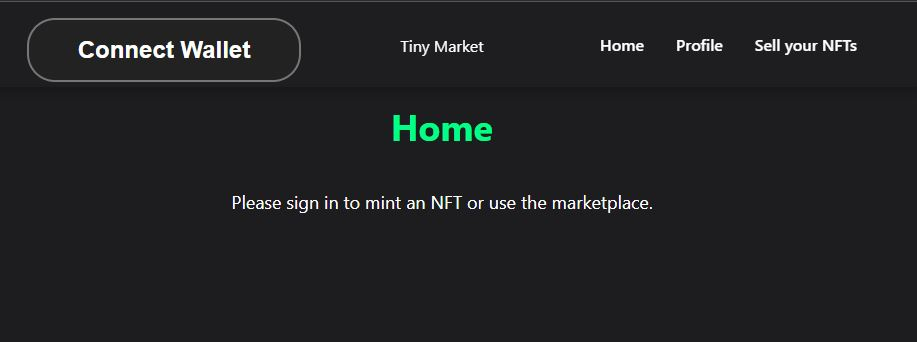

**Step 2:** 

Next login to wallet using the pop-up window.

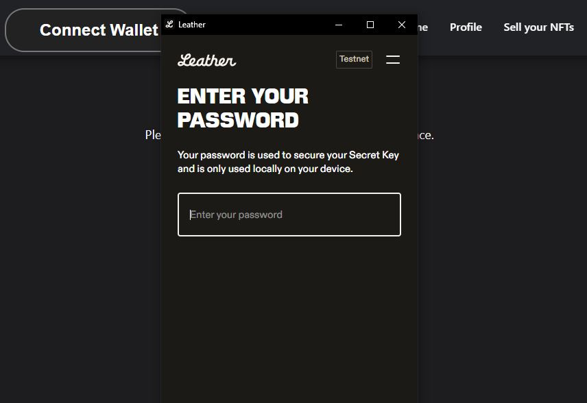


## View Owned Assets
**Step 1:** 

Via the navbar click on 'Profile' to navigate to the wallets profile page.

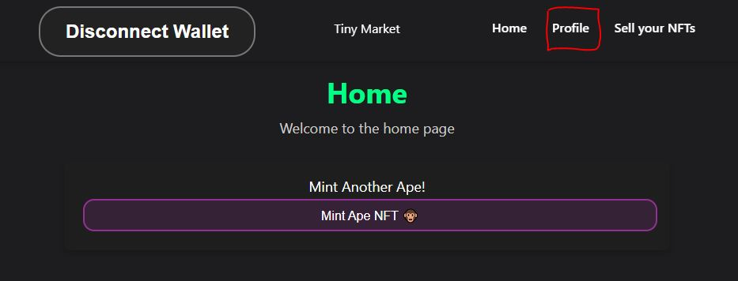


**Step 2:** 

Now the wallets Testnet and Mainnet NFTs are viewable.

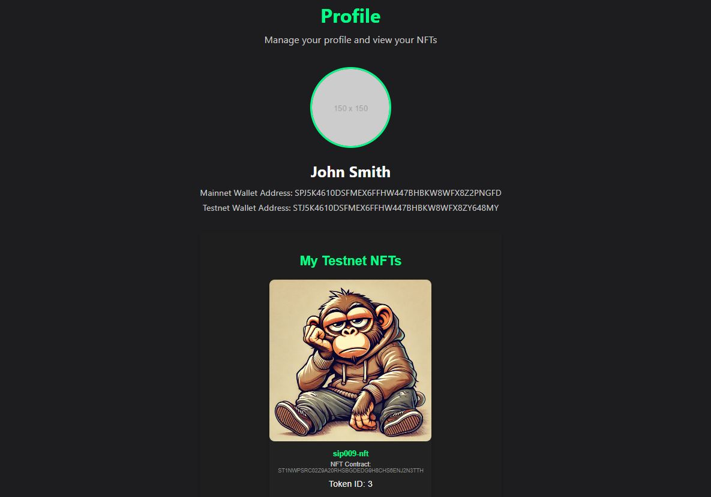


## List Owned Asset on Testnet
**Step 1:** 

Via the navbar click on 'AssetSell' to navigate to the asset sell page.

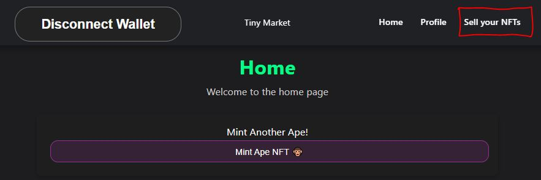


**Step 2:** 

Next fill the below form, specifying the desired asset to list along with the 'sell price' and 'expiry time' in block height and click continue.

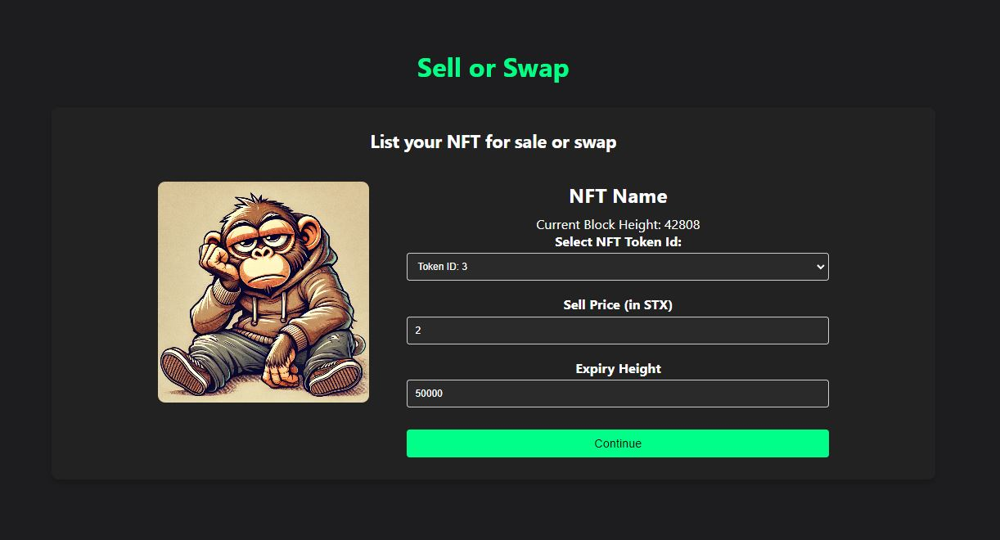


**Step 3:** 

Next using the pop-up window pick a network speed and confirm the listing.

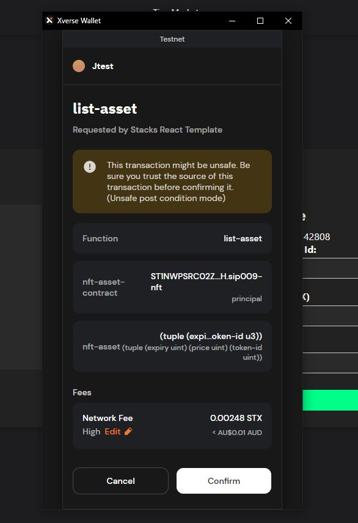


## Purchase Asset Using STX
**Step 1:** 

Via the home page view the currently listed available NFTs.

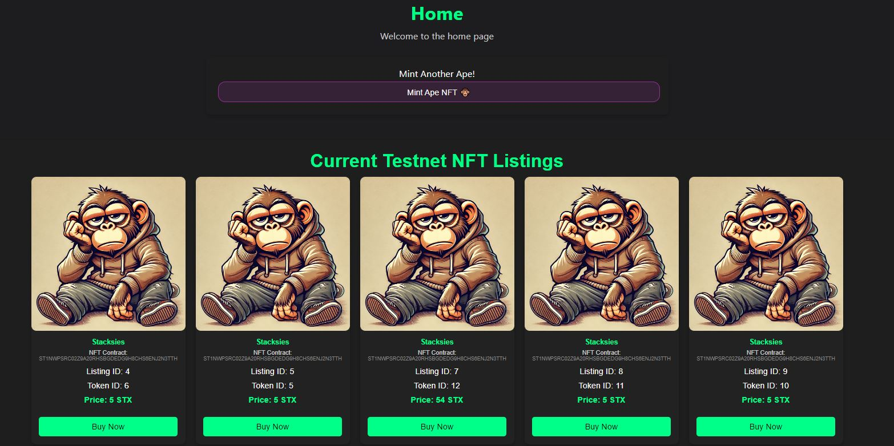


**Step 2:** 

Once desired NFT is chosen, click the 'buy now' button. Ensure that the connected wallet contains the correct amount of STX before purchasing.

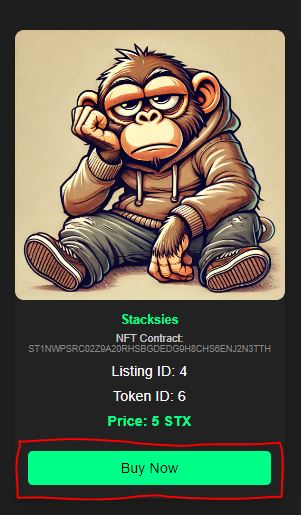


**Step 3:** 

Next using the pop-up window pick a network speed and confirm the purchase.

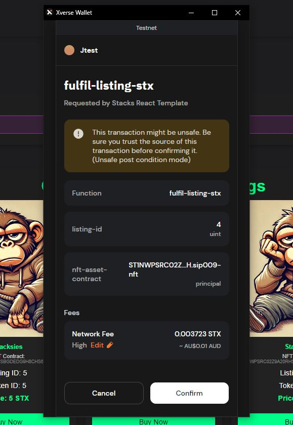


## Cancel NFT listing
**Step 1:** 

Via the navbar click on 'Cancel Listing' page to navigate to the asset Cancel Listing.

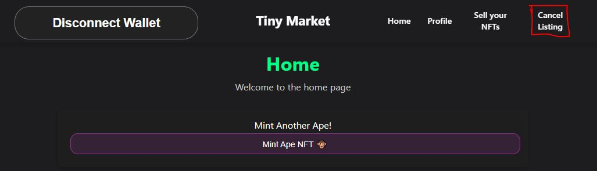


**Step 2:** 

Next view the cancel listing form and enter the listing id of the NFT which user wishes to cancel and click 'Cancel Listing' button.

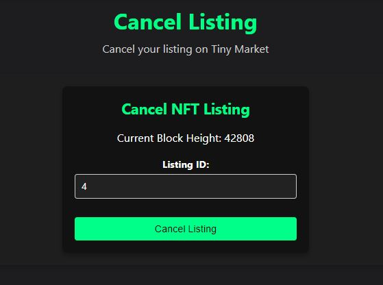


**Step 3:** 

Next using the pop-up window pick a network speed and confirm the purchase.

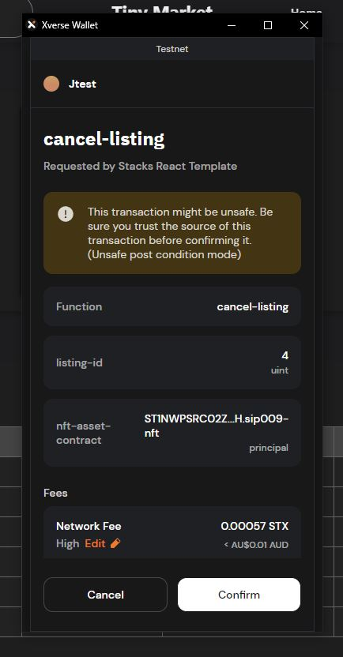


## Minting NFT (only available to contract deployer wallet)
**Step 1:** 

Once logged in, click one of the following buttons to mint an NFT.

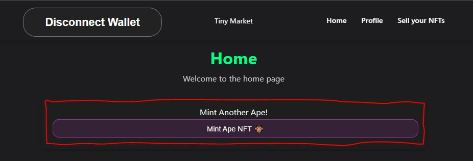


**Step 2:** 

Next using the pop-up window pick a network speed and confirm minting.

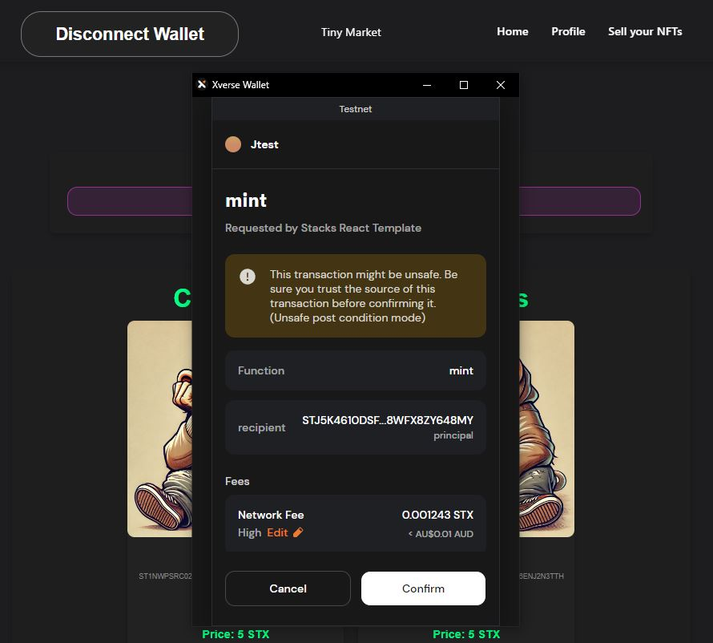


## Phase 2
If the project continues the following features will look at being implemented:
* Expiry date full functionality. 
* The Testnet NFTs have there imgs stored in the contract via a hash value and not hard coded 
* Multiple NFT contracts with different img hashes 
* Any user is able to mint and NFT, not just the owner of the NFT contract 
* Minting an NFT has an STX cost 
* Transaction list 

## Authors
- **James Parsons** - [jamesparsons529](https://github.com/jamesparsons529)
- **Elliot Horne** - [Elli0ttH0rne](https://github.com/Elli0ttH0rne)
- **Samaar Bajwa** - [Samaar-Bajwa](https://github.com/Samaar-Bajwa)
- **Alexei Delinicolis** - [MrSkribb](https://github.com/MrSkribb)
- **Yu Wei** - [forever003](https://github.com/forever003)

## Acknowledgments
- The author wishes to express gratitude to Delaware Nonprofit Foundation. Their [Clarity Camp](https://learn.stacks.org/course/clarity-camp) and stacks course greatly facilitated the teams understanding of creating an NFT marketplace.
